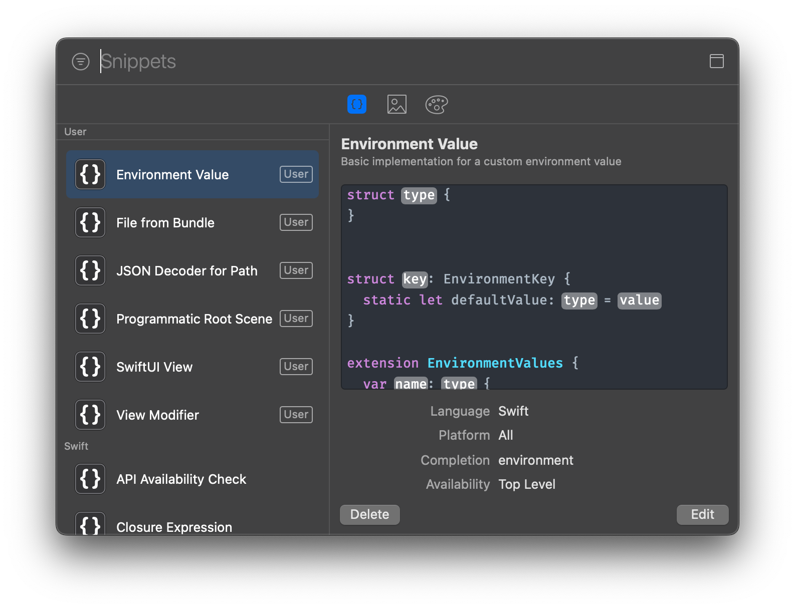

# 𝍎 XCSnippets

A collection of snippets for Xcode ready to install via SPM



## Installation

### Swift Package Manager (Recommended)

* Clone the repo
* Move to the repo folder
* Execute `swift run`

```bash
git clone https://github.com/SwiftyJourney/XCSnippets.git
cd XCSnippets
swift run
```

* **(Optional)** Remove the cloned project

```bash
cd ..
rm -rf XCSnippets
```

### Manual

* Download the repo (it can be clones, via zip, whatever you want)
* If it was via zip, uncompress the folder
* Go inside the folder
* Look for `Snippets` folder
* Copy the files inside `Snippets` folder into `~/Library/Developer/Xcode/UserData/CodeSnippets`
  * If UserData and/or FontAndColorThemes don't exist, just create them.

### Makefile

You can download [CodeSnippets-for-Xcode](https://github.com/SwiftyJourney/CodeSnippets-for-Xcode) instead if you want to use the makefile approach

## Snippets

| Name                                       | Alias                  | Description                                                                                                                           |
| ------------------------------------------ | ---------------------- | ------------------------------------------------------------------------------------------------------------------------------------- |
| Create SwiftUI Environment Key             | `envkeymodifier`       | Defines a custom environment key and its corresponding view modifier in SwiftUI for passing data down the view hierarchy.             |
| Create SwiftUI Modifier                    | `swiftuimodifier`      | Defines a custom SwiftUI ViewModifier for reusable view modifications.                                                                |
| Custom UIKit View Template                 | `customuiviewtemplate` | Provides a starting point for creating a custom UIView with style and layout customization.                                           |
| Decode JSON from path                      | `decodejsonpath`       | Decodes JSON data into a model object from a specified file path.                                                                     |
| Fetch Resource Path                        | `fetchresourcepath`    | Retrieves the file path for a resource from the main bundle.                                                                          |
| Programmatic ViewController setup          | `programmaticvc`       | Sets up a UIViewController with a vertical UIStackView and a UILabel programmatically.                                                |
| Setup Root ViewController programmatically | `setuprootvc`          | Initializes the UIWindow with a root UIViewController programmatically in the Scene Delegate, removing the need for storyboard setup. |
| SwiftUI View Template                      | `swiftuiviewtemplate`  | A template for creating a new SwiftUI view with customizable content.                                                                 |

## Attributions

[John Sundell](https://github.com/JohnSundell), because thanks to his libraries and its own theme, made this great installation process easier.
